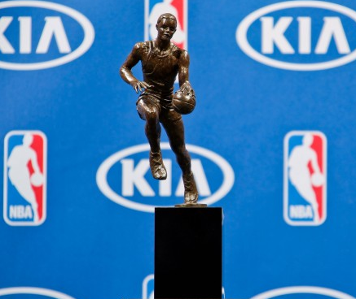

<!-- PROJECT LOGO -->
 

  

<h3 align="center">NBA MVP Predictor</h3>

  

    A machine learning model using RandomForest Regression that predicts NBA MVP's using player data.
     
    <a href="https://github.com/github_username/repo_name"><strong>Explore the docs »</strong></a>
     
     
    <a href="https://github.com/github_username/repo_name">View Demo</a>
    ·
    <a href="https://github.com/github_username/repo_name/issues">Report Bug</a>
    ·
    <a href="https://github.com/github_username/repo_name/issues">Request Feature</a>
  

<!-- ABOUT THE PROJECT -->
## About The Project

[![Product Name Screen Shot][product-screenshot]](https://example.com)

This project utilizes RandomForest Regression ML model to predict the NBA MVP. Now you may think that this is not a regression problem, but more of a classification problem, however our approach to predicting MVP consists of predicting a numerical variable called MVP win share. From that prediction, the player in the season with the highest MVP win share is predicted to be the MVP. As you can see structuring the problem like this lends more towards a regression solution.

 Our machine learning model is trained on data from 1980-2010, and then we use that to predict the MVP's for the 2011-2021 season.

(<a href="#top">back to top</a>)

### Built With

* [Python](https://www.python.org/)
* [Pandas](https://pandas.pydata.org/)
* [scikit-learn](https://scikit-learn.org/)
* [seaborn](https://seaborn.pydata.org/)
* [Matplotlib](https://matplotlib.org/)

(<a href="#top">back to top</a>)

### Examples of Graphs Used

### Usage

 To run this model, download the jupyter notebook, and data. Then within the file change the URL for the raw_mvp_data variable to the path wherethe data is located on your system.

<!-- Results -->
## Results

 The model achieved an R^2 value of 0.6127, guessing 8/10 of it's predictions correctly. 

<!-- Acknowledgements -->
## Acknowledgements
Inspiration from this article: (https://towardsdatascience.com/predicting-the-next-nba-mvp-using-machine-learning-62615bfcff75)
<!-- Acknowledgements -->
